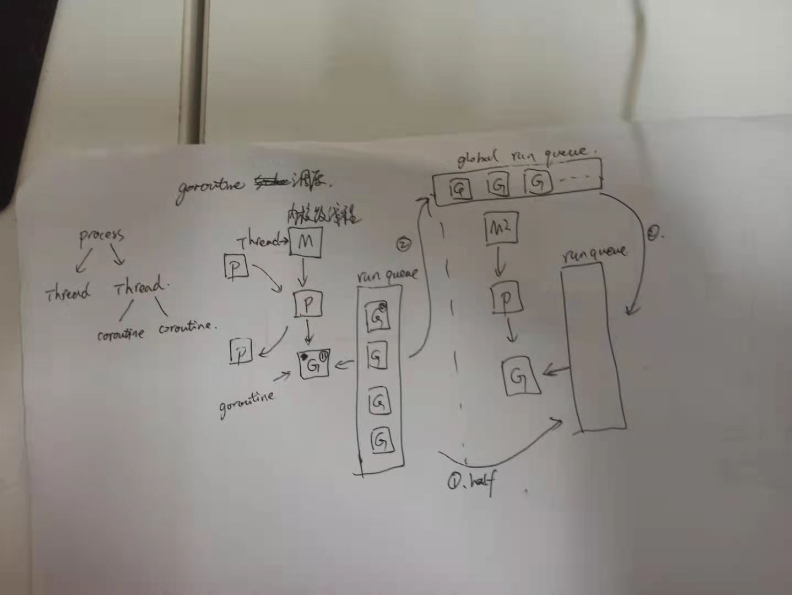

# Golang 常见面试题

ref：[cnBlog](https://www.cnblogs.com/wpgraceii/p/10528183.html)

origin ref: [origin](https://github.com/KeKe-Li/data-structures-questions)
or my fork on github [my fork](https://github.com/jianxinliu/data-structures-questions)

## 除了使用 Mutex 锁实现安全读写共享变量外，还有什么方式

可以使用 channel 。实现"以通讯共享内存"的 CSP 模式（https://www.jianshu.com/p/36e246c6153d）

## 无缓冲 channel 的收发是否同步

1. `ch := make(chan int)` 无缓冲 chan 由于没有缓冲，收发需同步
2. `ch := make(chan int, 2)` 有缓冲 chan 不要求收发同步。缓冲满时接收阻塞，缓冲空时发送阻塞。

## CSP 并发模型

CSP (Communicating Sequential Processes)

不同于传统的多线程通过共享内存来通信，CSP 以通信的方式共享内存。

## Golang 中常用的并发模型

### 通过 channel 通知实现并发控制

无缓冲通道 `ch := make(chan type)` 通道大小为 0，在接收者接收消息前，没有能力存储任何值，要求收发的 goroutine 同时准备好，才可以完成收发操作。

也就是说，收发的 goroutine 必须是同步的，否则，先操作的一方就会被阻塞，直到另一方做好准备。所以，无缓冲通道也被称为**同步通道**。

```go
func main() {
	ch := make(chan int)
	go func() {
		fmt.Println("start")
		time.Sleep(time.Second * 3)
		ch <- 0
	}()
	<- ch  // 阻塞，等待从通道中读取信号
	fmt.Println("done")
}
```

### 通过 sync 包中的 WaitGroup 实现并发控制

WaitGroup 用来实现同步等待，它会等待它收集的所有 goroutine 任务全部完成。包含三个方法：
1. Add, 可以添加或减少 goroutine 的数量
2. Done, 相当于 Add(-1)
3. Wait, 执行后会阻塞主线程，知道 WaitGroup 的值减至 0

```go
func main() {
	var wg sync.WaitGroup
	var urls = []string{
		"http://sss.xxx",
		"http://www.rrr"
	}
	for _, url := range urls {
		wg.Add(1)
		go func(url string) {
			defer wg.Done()
			http.Get(url)
		}(url)
	}
	wg.Wait() // 会等到所有 URL 都完成请求
}
```

需要注意的是，WaitGroup 一旦被使用后，不能被复制。即，若需要将 WaitGroup 传入函数，则必须传引用（或直接使用闭包引用外部变量），不能传值。如在函数内部调用 Done，则实际上是在 WaitGroup 的副本上调用，这样函数外的 WaitGroup 永远不会结束，即造成死锁。

### Go 1.7 之后的 Context，进行并发控制

Context 是 goroutine 的上下文，包括一个程序的运行环境、现场和快照等。通常 Go 将这些封装在一个 Context 里，再将它传给需要执行的 goroutine。

Context 包主要用来处理多个 goroutine 之间共享数据，即多个 goroutine 的管理。

## Data Race 问题怎么解决？能不能不加锁解决

同步访问共享数据是处理数据竞争的一种有效方法。golang 在 1.1 只后引入了竞争检测机制，可使用 `go run -race` 或 `go build -race` 来进行静态检测。其内部实现是，开启多个协程执行同一个命令，并且记录下每个变量的状态。

## Go GC 

GO GC 采取“非分代的、非移动的、并发的、三色的”标记清除算法。Java 也采用标记清除算法，但后者更加负责，因为内存分为多代，且各具特点，所以会针对性得采用不同的 GC 算法。Java 进行标记清除后会移动被保留的内存块来规整内存。

GC 阶段：

1. 栈扫描（STW）
2. 第一次标记
3. 第二次标记（STW）
4. 清除（并发）

[详细 GC 介绍](https://github.com/KeKe-Li/For-learning-Go-Tutorial/blob/master/src/spec/02.0.md)


## goroutine 的调度

GPM 模型实现强大的并发。G(Goroutine), P(Processor), M(Thread)

1. G Goroutine 代表一个 goroutine
2. P Processor, 用于执行 goroutine, 内部维护一个队列，用于存储所需要的执行的 goroutine
3. M Machine 代表内核级线程，goroutine 运行其上, 数量对应真正的 CPU 数
4. Sched 调度器， 维护有存储 M 和 G 的队列

调度实现：



GPM 可以简要概括为：事件循环、线程池、工作队列


## 负载均衡

将请求合理均衡得分摊到多台服务器上。

有四种主要类型： (LB4, LB7)

1. HTTP(七层)
2. HTTPS(七层)
3. TCP(四层)
4. UDP(四层)

常见 LB 算法

1. 轮询。按顺序派发
2. 最小连接。优先选择连接数最少的服务器。
3. 根据请求源 IP 进行 hash 。一定程度上可以保证特定用户能连接到相同的服务器，在需要有状态的应用中适用。


