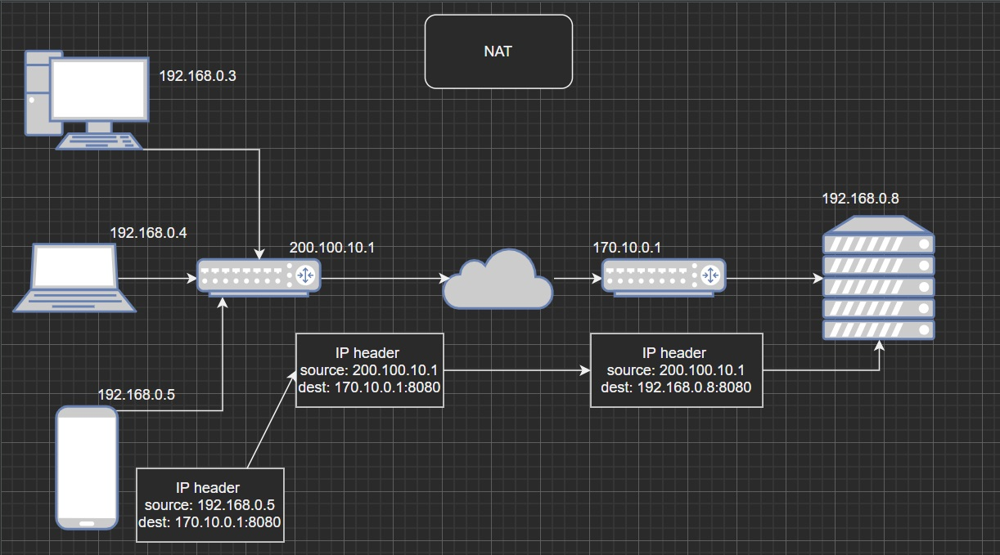

# IP 在第几层

第三层。

## IP 头有什么，尽量详细

源 IP 和目标 IP。

# TCP 与 UDP 的区别

# Https 安全在哪儿

先说http不安全在那里。即相当于明文传输，会被窃取会被伪造。https在传输时对信息加密。一般采用非对称加密算法，传输密钥时使用安全证书认证确认对方身份。

# Http 2.0 的内容

# NAT
Network Address Translation(网络地址转换)。

用于内网地址和公网（network address）地址间的转换。

## 为什么需要区分内网地址和外网地址

主要是因为 IPV4 地址不够用，分成公网和私网后，很多设备就可以共用一个公网 IP ，而私网（局域网）内可使用几乎所有可分配的 IP ，且在不同私网内可以相同，解决了很多设备上网的问题。

## 为什么需要地址转换？

就像是在国内使用身份证，在国外就得使用护照确定人的身份一样， IP 地址也分使用范围，内网和内网的地址可以相同（都是 501 宿舍，一个在一栋，一个在三栋，自然可以相同且不冲突），外网地址必须唯一，且由机构统一分配。

[from wikipedia](https://en.wikipedia.org/wiki/Network_address_translation):
> NAT is a method of mapping an IP address space into another by modifying network address information in the IP header of packets while they are in transit across a traffic routing device.

.jpg)

> The majority of network address translators map multiple private hosts to one publicly exposed IP address. In a typical configuration, a local network uses one of the designated private IP address subnets (RFC 1918). A router in that network has a private address of that address space. The router is also connected to the Internet with a public address, typically assigned by an Internet service provider. As traffic passes from the local network to the Internet, the source address in each packet is translated on the fly from a private address to the public address. The router tracks basic data about each active connection (particularly the destination address and port). When a reply returns to the router, it uses the connection tracking data it stored during the outbound phase to determine the private address on the internal network to which to forward the reply.

> 大部分的 NAT 都是将多个私有 IP 映射成一个向互联网暴露的公有 IP。典型的配置中，一个局域网中的设备共用一个指定的私有 IP 子网（RFC 1918）。局域网的路由器一端连着子网，一端连着公网。局域网的数据包要发往因特网，数据包中的源地址会被转换为该局域网被分配的公网 IP。路由器会记录每个活跃连接的基础信息（主要是目标地址和端口），当响应发回路由器时，路由器会利用已记录的信息，决定该数据包发往子网中的哪个设备（地址）。

> All IP packets have a source IP address and a destination IP address. Typically packets passing from the private network to the public network will have their source address modified, while packets passing from the public network back to the private network will have their destination address modified. To avoid ambiguity in how replies are translated, further modifications to the packets are required. The vast bulk of Internet traffic uses Transmission Control Protocol (TCP) or User Datagram Protocol (UDP). For these protocols the port numbers are changed so that the combination of IP address (within the IP header) and port number (within the Transport Layer header) on the returned packet can be unambiguously mapped to the corresponding private network destination. RFC 2663 uses the term network address and port translation (NAPT) for this type of NAT. Other names include port address translation (PAT), IP masquerading, NAT overload and many-to-one NAT. This is the most common type of NAT and has become synonymous with the term "NAT" in common usage.

> 所有的 IP 数据包都有源 IP 地址和目的 IP 地址。一般的，数据包从私网发往公网，源地址会被修改；数据包经过公网到达对方的私网，数据包目标地址也会被修改。

# poll 与 epoll 的区别

https://www.cnblogs.com/aspirant/p/9166944.html

http://www.ulduzsoft.com/2014/01/select-poll-epoll-practical-difference-for-system-architects/

https://daniel.haxx.se/docs/poll-vs-select.html

https://stackoverflow.com/questions/4039832/select-vs-poll-vs-epoll

# 数组访问为什么更快

相比链表，数组在内存中是成块得存储，而链表是块式存储。应为空间局部性原理，在 CPU 去内存取数据时，会一次性取一块数据到一级缓存（...），访问数组下一元素，可能就在一级缓存中，减少访问内存的开销，所以更快。而采用链式存储，CPU 取数据时，成块得取数据，而链表的下一个节点并不一定在该块内，访问下一节点还得再访问内存。

# golang 中的 map 使用有什么需要注意的

Map 在并发环境下，只读是安全的，同时读写是不安全的。

使用 sync.Map

# golang slice 作为参数传入函数是传的引用还是值

是引用。函数的参数都是传入的值的复制，slice 传入的也是值，只是这个值是 slice 在原始数组中的起始地址。将地址复制，再进行修改，仍然可以修改源数据，所以相当于传的是引用。